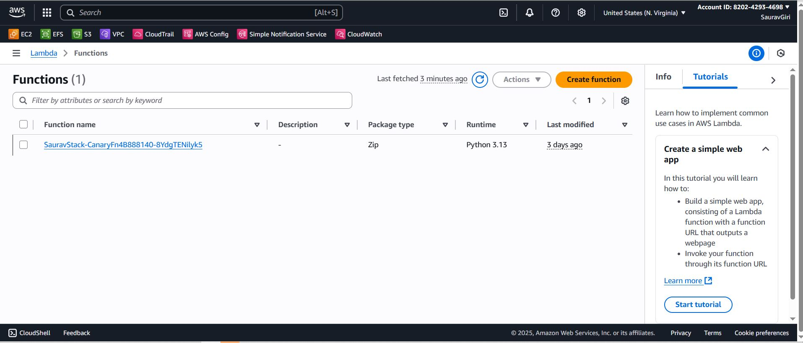
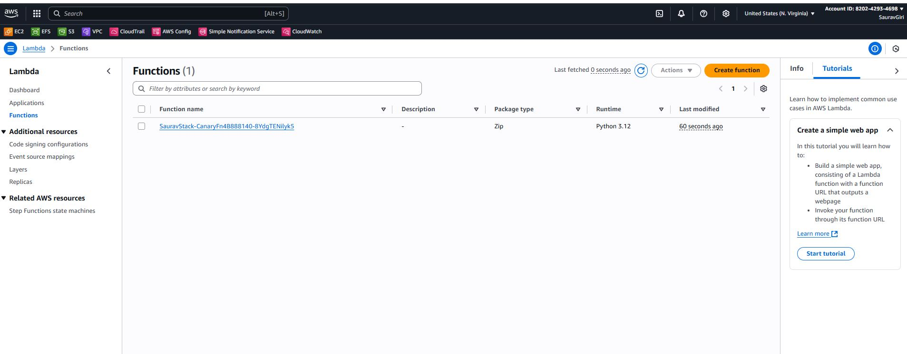
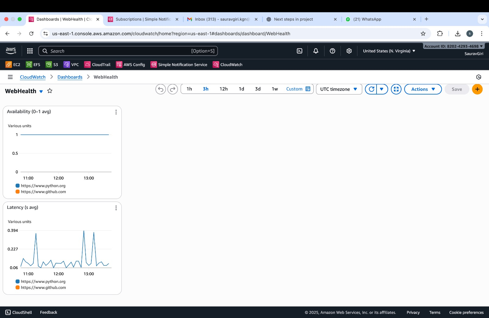
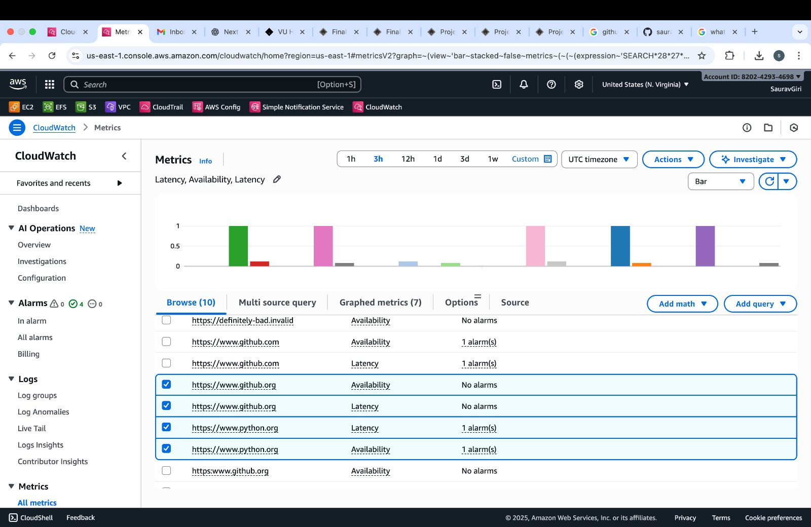
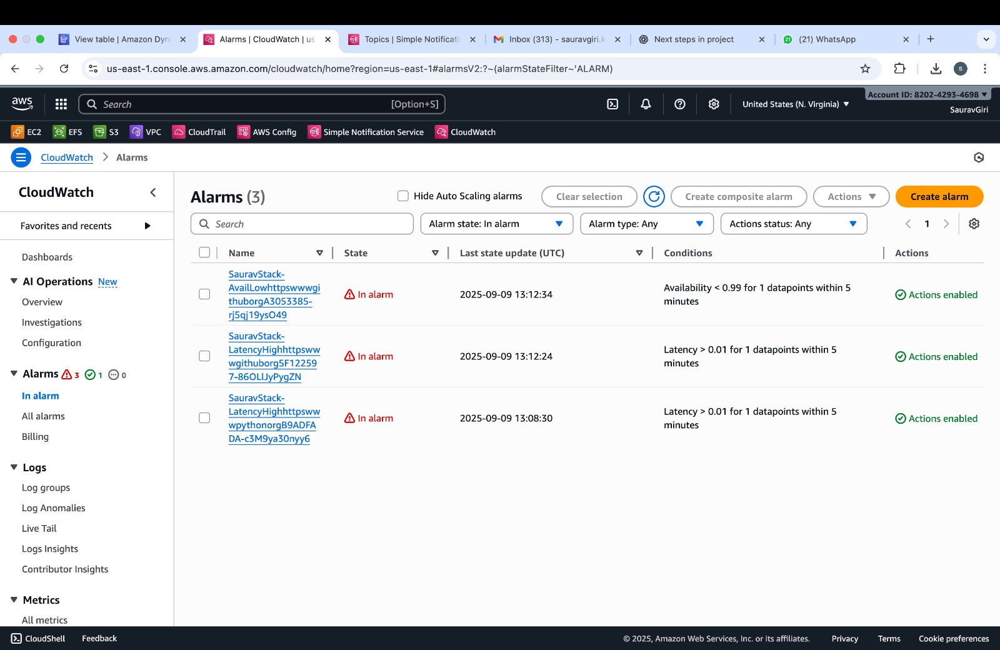
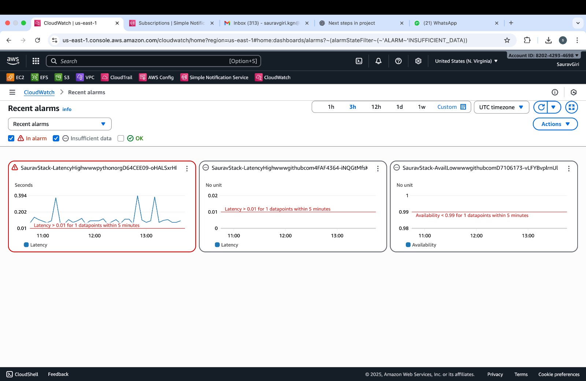
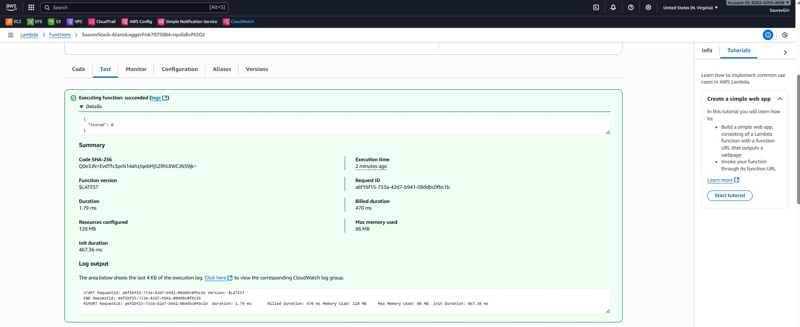
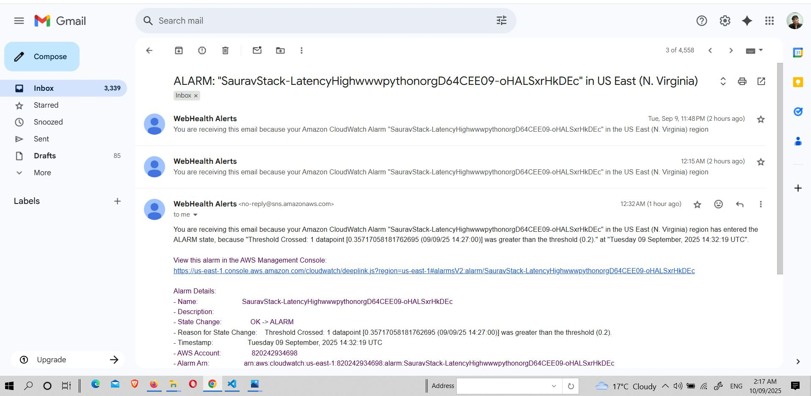

# WebHealth Monitoring System – AWS Lambda + CDK (Python)

## Course: NIT6150 – Advanced Project  
**Supervisor:** Ayesha Binte Ashfaq  
**Student:** Saurav Giri (s8138673)  

---

##  Table of Contents
- [Part A: User Manual](#part-a-user-manual)
  - [Step 1 – Canary Lambda (Single URL)](#step-1--canary-lambda-single-url)
  - [Step 2 – Multi-URL + Dashboard](#step-2--multi-url--dashboard)
  - [Step 3 – Alarms + SNS + DynamoDB](#step-3--alarms--sns--dynamodb)
  - [Troubleshooting](#troubleshooting)
- [Part B: Project Evaluation Report](#part-b-project-evaluation-report)
  - [Implementation Process, Testing, and Schedule](#implementation-process-testing-and-schedule)
  - [Challenges and Problem Solving](#challenges-and-problem-solving)
  - [Strengths, Limitations, and Future Recommendations](#strengths-limitations-and-future-recommendations)
  - [Computer Ethics and Reflection](#computer-ethics-and-reflection)
  - [Critical Reflection](#critical-reflection)
  - [References](#references)
- [Part C: Documentation](#part-c-documentation)

---

# Part A: User Manual

This system is developed using **AWS CDK (Python)** to monitor website health by checking **Availability** and **Latency** of multiple URLs. The monitoring is performed in three main steps.

---

## Step 1 – Canary Lambda (Single URL)

- Deployed a Lambda function (`CanaryFn`) to monitor a  URL (`https://www.google.com`).  
- Metrics (`Availability`, `Latency`) are published into CloudWatch.  
- Scheduled every 5 minutes using EventBridge.  

**Screenshot – Canary Lambda Deployment**  
  

**Screenshot – CloudWatch Metrics (Availability & Latency)**  
  
  

**Reflection:**  
This validated the AWS Lambda + CloudWatch integration. The main challenge was IAM permission for metric publishing, which was solved by attaching a CloudWatch PutMetricData policy.  

---

## Step 2 – Multi-URL + Dashboard

- Extended Lambda to monitor multiple URLs (`python.org`, `github.com`).  
- Added a **CloudWatch Dashboard** for visualization.  
- Configured URLs using environment variables.  

**Screenshot – Lambda Environment Variables**  
  

**Screenshot – CloudWatch Dashboard and Metrics**  

  

**Reflection:**  
This showed scalability — from single to multiple URLs. The dashboard provided a central view of system health, but required tuning the refresh rate to match EventBridge scheduling.  

---

## Step 3 – Alarms + SNS + DynamoDB

- Configured **CloudWatch Alarms**:  
  - Availability `< 0.99`  
  - Latency `> 0.20s`  
- SNS topic sends alerts to:  
  -  Email (`sauravgiri3137@gmail.com`)  
  - Logger Lambda (stores alarm events in DynamoDB).  
- DynamoDB stores alarm logs with a 30-day TTL.  

**Screenshot – CloudWatch Alarm Triggered and  Alarm Dashboard**  
  
 
 

**Screenshot – SNS Email Notification**  
  

**Screenshot – DynamoDB Alarm Logs**  
  

**Reflection:**  
The alarm workflow connected monitoring to action: detect → notify → persist. A major issue was DynamoDB rejecting floats, fixed by converting to `Decimal`.  

---

## Troubleshooting

- **No alarms triggered?**  
  Lower thresholds (e.g., Latency > 0.05s).  

- **DynamoDB empty?**  
  Check CloudWatch logs for `AlarmLoggerFn`. Ensure Decimal fix is applied.  

- **No email received?**  
  Confirm SNS subscription via inbox (check spam).  

---

# Part B: Project Evaluation Report

---

## Implementation Process, Testing, and Schedule

### Implementation Process
1. **Step 1:** Single URL monitoring with Lambda + CloudWatch metrics.  
2. **Step 2:** Multi-URL monitoring, added CloudWatch dashboard.  
3. **Step 3:** Alarms, SNS notifications, DynamoDB persistence.  

### Testing
- Manual alarm testing by lowering thresholds.  
- SNS test message published to confirm email and Lambda delivery.  
- DynamoDB verified through alarm-triggered inserts.  
- Logs checked in CloudWatch for debugging.  

### Schedule
- **Week 1–2:** AWS setup, CDK bootstrap, environment preparation.  
- **Week 3–4:** Step 1 (single URL canary).  
- **Week 5–6:** Step 2 (multi-URL + dashboard).  
- **Week 7–8:** Step 3 (alarms + SNS + DynamoDB).  
- **Week 8:** Testing, troubleshooting, documentation, demo prep.  

---

## Challenges and Problem Solving

- **DynamoDB rejected floats**  
  - *Cause:* boto3 does not support Python floats directly.  
  - *Solution:* Converted floats to `Decimal`.  

- **Alarms constantly in ALARM**  
  - *Cause:* Thresholds were set too low (e.g., Latency > 0.01).  
  - *Solution:* Adjusted to practical thresholds (e.g., Latency > 0.20s).  

- **Confusion with repeated `cdk deploy`**  
  - *Solution:* Standardized GitHub repo, created pull request for collaboration and submission.  

---

## Strengths, Limitations, and Future Recommendations

### Strengths
- Fully automated deployment (Infrastructure as Code with CDK).  
- Scalable: URLs easily added via environment variables.  
- Persistent log of alarm events in DynamoDB.  

### Limitations
- Static thresholds → potential false positives.  
- Visualization limited to CloudWatch.  
- Locked into AWS ecosystem.  

### Future Recommendations
- Use ML-based anomaly detection instead of fixed thresholds.  
- Integrate Grafana for richer dashboards.  
- Extend alerts to collaboration tools (Slack, Teams).  

---

## Computer Ethics and Reflection

- **Privacy & Security:** Only public websites monitored; no sensitive data collected.  
- **Transparency:** DynamoDB logs ensure traceability.  
- **Responsibility:** Alarms tuned to avoid unnecessary panic or false alerts.  

**Reference:** ACM Code of Ethics (2018) – Section 1.2: “Avoid harm.”  

---

## Critical Reflection

This project improved my skills in:  
- AWS infrastructure automation (Lambda, CDK, CloudWatch, DynamoDB).  
- Debugging real-world issues (IAM, event payloads, Decimal handling).  
- Using GitHub effectively (pull requests, commits, version control).  

**Key Takeaway:** Monitoring is not just technical; it requires ethical responsibility to ensure accuracy and reliability.  

---

## References

- Amazon Web Services. (2023). *Boto3 Documentation*. https://boto3.amazonaws.com  
- ACM. (2018). *Code of Ethics and Professional Conduct*. https://www.acm.org/code-of-ethics  
- Bass, L., Clements, P., & Kazman, R. (2012). *Software Architecture in Practice*. Addison-Wesley.  

---

# Part C: Documentation

- **Installation Guide:** Provided in user manual.  
- **Meeting Minutes:** Weekly updates recorded.  
- **Task Distribution:**  
  - Saurav: Lambda + CDK, Dashboard & testing,Documentation & GitHub.  

- **Version Control Proof:**  
  - GitHub commits demonstrate incremental progress.  
  - Pull request created before final presentation (proof of collaboration).  

---

 *Prepared by:* **Saurav Giri**  
  
